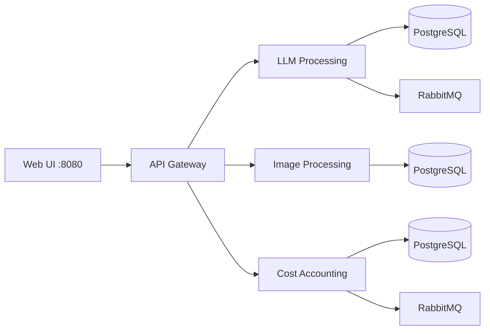

# AI Pool — микросервисная платформа

Набор микросервисов для обработки LLM-запросов, генерации изображений и учёта затрат с единой точкой входа (API Gateway) и веб-интерфейсом.

## Архитектура



| Сервис | Порт (compose) | Назначение |
|--------|----------------|------------|
| **api-gateway-service** | 8080 | UI, чаты, оркестрация запросов |
| **llm-processing-service** | внутренний | Асинхронные LLM-задачи |
| **image-processing-service** | внутренний | Генерация изображений |
| **cost-accounting-service** | внутренний | Учёт затрат, курсы валют |

## Быстрый старт

```bash
docker compose up --build -d
```

Откройте в браузере: **http://localhost:8080**

- Swagger Gateway: http://localhost:8080/docs
- Создайте чат → выберите режим LLM или Image → отправьте сообщение

## Тесты

### Юнит-тесты (без Docker)

```bash
cd api-gateway-service && pip install -r requirements.txt && pytest tests/ -v
cd image-processing-service && pip install -r requirements.txt && pytest tests/ -v
```

### Интеграционные тесты (полный стек)

```bash
docker compose up --build -d
pip install -r integration-tests/requirements.txt
set RUN_INTEGRATION=1
pytest integration-tests/ -m integration -v
```

## CI/CD

Пайплайн GitHub Actions (`.github/workflows/ci.yml`):

1. Юнит-тесты gateway и image-processing
2. Сборка Docker-образов
3. Интеграционные тесты на `docker compose`

## Документация сервисов

- [api-gateway-service/README.md](api-gateway-service/README.md)
- [llm-processing-service/README.md](llm-processing-service/README.md)
- [image-processing-service/README.md](image-processing-service/README.md)
- [cost-accounting-service/README.md](cost-accounting-service/README.md)
- [API_STANDARDS.md](API_STANDARDS.md)

## OpenAPI

Спецификации в каталоге `openapi/`.
